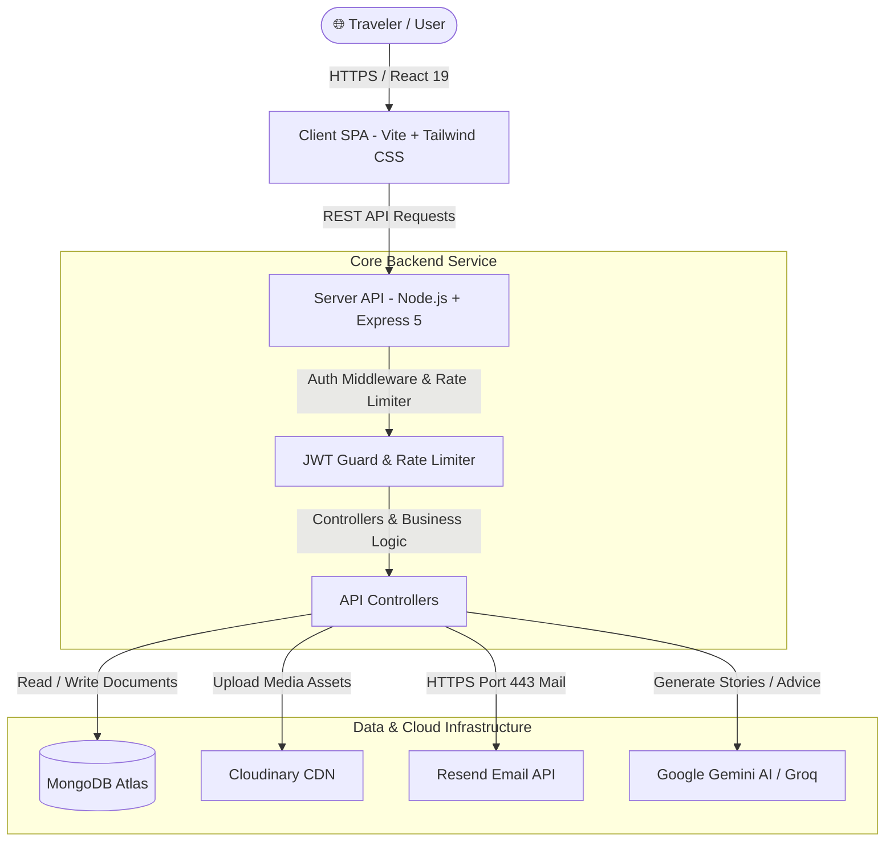

<div align="center">

  <h1>🌍 AVORA</h1>
  <p><b>Your Ultimate Intelligent Travel Diary & Experience Platform</b></p>
  <p><i>Capture, map, refine, and preserve your journey memories with AI-powered storytelling and interactive mapping.</i></p>

  <br />

  [](https://react.dev/)
  [](https://vitejs.dev/)
  [](https://tailwindcss.com/)
  [](https://nodejs.org/)
  [](https://expressjs.com/)
  [](https://www.mongodb.com/)
  [](https://ai.google.dev/)
  [](https://cloudinary.com/)
  [](https://resend.com/)

  <br />

  [Key Features](#-key-features) •
  [Tech Stack](#-technology-stack) •
  [Architecture](#-system-architecture) •
  [Getting Started](#-getting-started) •
  [Environment Variables](#-environment-variables) •
  [API Reference](#-api-endpoints-reference) •
  [Project Structure](#-project-structure)

</div>

<br />

---

## 📖 Overview

**Avora** is a state-of-the-art MERN stack travel journaling platform designed for travelers, creators, and adventurers to record, organize, and share their journey memories. Built with **React 19**, **Tailwind CSS v4**, **Node.js Express 5**, and **MongoDB Atlas**, Avora seamlessly blends interactive map visualization with AI-driven travel story polishing, enterprise-grade authentication, cloud media storage, and native PDF exporting.

> [!NOTE]
> **Why Avora?** Traditional journals lose media context, while simple social media lacks privacy and long-form narrative structure. Avora provides a secure, private, and intelligent digital canvas for your life's greatest journeys.

---

## ✨ Key Features

### 🗺️ Interactive Travel Maps & Journals
* **Location Pinning:** Map your memories geographically using **Leaflet & React-Leaflet**.
* **Rich Memory Stories:** Full CRUD capabilities for travel memories with rich text markdown, custom cover photos, visit dates, and multi-media support.
* **Interactive Media Gallery:** Store up to 20 media assets per journal entry, powered by Cloudinary CDN.

### 🤖 AI-Powered Travel Assistant
* **Smart Story Refinement:** Integrated with **Google Gemini AI** and **Groq / OpenAI SDKs** to assist travelers in expanding notes into captivating travel narratives.
* **Itinerary & Advice Generation:** Interactive AI assistant endpoint to suggest local attractions, packing lists, and hidden gems.

### 🔒 Enterprise-Grade Auth & Security
* **JWT & Password Encryption:** Secure authentication with JSON Web Tokens and `bcryptjs` hashing algorithms.
* **Global Session Invalidation:** Password updates immediately trigger `passwordChangedAt` recalculation, instantly revoking active sessions across all devices.
* **Brute-Force Rate Limiting:** 24-hour rate limiting on sensitive password reset endpoints (`express-rate-limit`).
* **Google OAuth Integration:** Instant, seamless social login using `@react-oauth/google`.

### 📧 Reliable Email Delivery
* **Resend API Integration:** Password reset and notification emails dispatched via **Resend API over HTTPS Port 443**, bypassing cloud provider SMTP port blockages (Ports 25/587).

### 🛡️ Administrative Control & RBAC
* **Admin Approval Workflow:** Mandatory account approval workflow supporting `pending`, `approved`, and `suspended` statuses.
* **Role-Based Guards:** Strict API route guards and UI state controls distinguishing standard travelers from system administrators.

### 📄 Exporting & Document Sharing
* **PDF & Image Journal Exports:** Export full memories and travel logs as high-resolution PDFs or images using `jspdf`, `html2pdf.js`, and `html2canvas`.

---

## 📐 System Architecture



---

## 🛠️ Technology Stack

| Domain | Technology | Description |
| :--- | :--- | :--- |
| **Frontend Framework** | **React 19** & **Vite 8** | Modern, ultra-fast client single-page application |
| **Styling & Icons** | **Tailwind CSS v4** & **Lucide React** | Utility-first styling with sleek typography (`Outfit`) |
| **Maps & Interactive** | **Leaflet** & **React-Leaflet** | Interactive vector mapping and custom pin markers |
| **Export Engines** | **jspdf**, **html2pdf.js**, **html2canvas** | High-fidelity PDF generation & DOM image capture |
| **Backend Runtime** | **Node.js** & **Express.js 5** | Scalable RESTful API architecture |
| **Database & ODM** | **MongoDB Atlas** & **Mongoose** | Cloud NoSQL database with schema validation |
| **Authentication** | **JWT**, **bcryptjs**, **Google OAuth** | Token security, password hashing, and social login |
| **AI Intelligence** | **Google Gemini AI** & **Groq SDK** | AI narrative expansion and intelligent assistance |
| **Media Engine** | **Cloudinary** & **Multer** | Scalable image uploads, cloud CDN transformations |
| **Email Service** | **Resend API** | Reliable transactional email over HTTPS Port 443 |
| **Deployment** | **Vercel** (Client) & **Render** (Server) | Continuous deployment infrastructure |

---

## 🚀 Getting Started

Follow these step-by-step instructions to get a local development instance of **Avora** up and running.

### 📋 Prerequisites

Make sure you have the following installed on your machine:
* [Node.js](https://nodejs.org/) (v18.x or higher)
* [npm](https://www.npmjs.com/) or [yarn](https://yarnpkg.com/)
* [Git](https://git-scm.com/)

You will also need credentials for:
* [MongoDB Atlas](https://www.mongodb.com/cloud/atlas) (Database Connection String)
* [Cloudinary](https://cloudinary.com/) (Cloud Name, API Key & Secret)
* [Resend](https://resend.com/) (API Key for transactional emails)
* [Google Gemini API Key](https://ai.google.dev/) (For AI travel assistant features)

---

### 📥 1. Clone the Repository

```bash
git clone https://github.com/ResmalMubarakV/Avora.git
cd Avora
```

---

### 📦 2. Install Dependencies

#### Backend Server:
```bash
cd server
npm install
```

#### Frontend Client:
```bash
cd ../client
npm install
```

---

### 🔑 3. Environment Variables Configuration

Create a `.env` file in the `server/` directory:

```bash
touch server/.env
```

Add the following environment variables to `server/.env`:

```env
# Server Configuration
PORT=8000
CLIENT_URL=http://localhost:5173
NODE_ENV=development

# Database & Security
MONGO_URI=mongodb+srv://<username>:<password>@cluster.mongodb.net/avora?retryWrites=true&w=majority
JWT_SECRET=your_super_secret_jwt_key_here

# Transactional Email Service (Resend)
RESEND_API_KEY=re_123456789_your_resend_key

# Cloud Media Storage (Cloudinary)
CLOUDINARY_CLOUD_NAME=your_cloud_name
CLOUDINARY_API_KEY=your_cloudinary_api_key
CLOUDINARY_API_SECRET=your_cloudinary_api_secret

# AI Assistant Service
GEMINI_API_KEY=your_google_gemini_api_key
```

*(Optionally configure Google OAuth variables in `client/` if using Google Sign-In).*

---

### 💻 4. Running the Development Application

#### Start Backend API Server:
```bash
cd server
npm run dev
```
> Server will start listening at `http://localhost:8000`

#### Start Frontend Client:
Open a second terminal window:
```bash
cd client
npm run dev
```
> Client application will open at `http://localhost:5173`

---

## ⚙️ Environment Variables Reference

| Variable Name | Required | Description |
| :--- | :---: | :--- |
| `PORT` | Yes | Port for Express server (Default: `8000`) |
| `MONGO_URI` | Yes | MongoDB Atlas connection URI |
| `JWT_SECRET` | Yes | Secret key for signing JWT tokens |
| `CLIENT_URL` | Yes | Frontend application URL for CORS rules |
| `RESEND_API_KEY` | Yes | API key for Resend email service |
| `CLOUDINARY_CLOUD_NAME` | Yes | Cloudinary Cloud Name |
| `CLOUDINARY_API_KEY` | Yes | Cloudinary API Key |
| `CLOUDINARY_API_SECRET` | Yes | Cloudinary API Secret |
| `GEMINI_API_KEY` | Optional | Google Gemini API key for AI features |

---

## 🔌 API Endpoints Reference

### 🔐 Authentication Routes (`/api/auth`)
| Method | Endpoint | Access | Description |
| :--- | :--- | :--- | :--- |
| `POST` | `/register` | Public | Register a new traveler account |
| `POST` | `/login` | Public | Authenticate user & return JWT token |
| `POST` | `/forgot-password` | Public (Rate Limited) | Send password reset email via Resend |
| `POST` | `/reset-password/:token` | Public | Reset password with valid token |

### 📸 Travel Memories (`/api/memories`)
| Method | Endpoint | Access | Description |
| :--- | :--- | :--- | :--- |
| `GET` | `/` | Private | Fetch all user travel memories |
| `GET` | `/dashboard-overview` | Private | Fetch dashboard metrics & recent journals |
| `POST` | `/` | Private | Create new memory with cover & media files |
| `GET` | `/:id` | Private | Fetch single memory details |
| `PUT` | `/:id` | Private | Update memory contents and media |
| `PATCH` | `/:id/like` | Private | Toggle favorite / like status |
| `PATCH` | `/:id/pin` | Private | Toggle pinned memory status |
| `DELETE` | `/:id` | Private | Delete memory entry and cloud assets |

### 🤖 AI Assistant (`/api/ai`)
| Method | Endpoint | Access | Description |
| :--- | :--- | :--- | :--- |
| `POST` | `/` | Private | Generate AI narrative expansions & advice |

### 🛡️ Admin Management (`/api/admin`)
| Method | Endpoint | Access | Description |
| :--- | :--- | :--- | :--- |
| `GET` | `/users` | Admin | List all registered accounts |
| `PATCH` | `/users/:id/status` | Admin | Update account status (`approved`, `suspended`) |

---

## 📁 Project Structure

```
Avora/
├── 📁 client/                    # Frontend React SPA
│   ├── 📁 public/                # Static assets & favicons
│   ├── 📁 src/
│   │   ├── 📁 components/        # UI components & map widgets
│   │   ├── 📁 pages/             # Application route views
│   │   ├── 📁 utils/             # Helper utilities & API clients
│   │   ├── 📄 App.jsx            # Main app entry & routing
│   │   └── 📄 main.jsx           # React DOM root
│   ├── 📄 package.json           # Frontend dependencies
│   └── 📄 vite.config.js         # Vite bundler configuration
│
└── 📁 server/                    # Backend Express API Server
    ├── 📁 config/                # Database connection setup
    ├── 📁 constants/             # Application constants & reserved names
    ├── 📁 controllers/           # Route business logic handlers
    ├── 📁 middleware/            # Auth guard, rate limiters, upload uploaders
    ├── 📁 models/                # Mongoose schemas (User, Memory)
    ├── 📁 routes/                # Express API endpoint definitions
    ├── 📁 templates/             # Responsive HTML email templates
    ├── 📁 utils/                 # Resend mailer & helper utilities
    ├── 📄 server.js              # Express app server entry point
    └── 📄 package.json           # Server dependencies
```

---

## 🤝 Contributing

Contributions make the open-source community an amazing place to learn, inspire, and create. Any contributions you make are **greatly appreciated**!

1. Fork the Project
2. Create your Feature Branch (`git checkout -b feature/AmazingFeature`)
3. Commit your Changes (`git commit -m 'Add some AmazingFeature'`)
4. Push to the Branch (`git push origin feature/AmazingFeature`)
5. Open a Pull Request

---

## 📄 License

Distributed under the **ISC License**. See `LICENSE` for more information.

---

<div align="center">
  <p>Crafted with ❤️ by <b><a href="https://github.com/ResmalMubarakV">Resmal Mubarak V</a></b></p>
  <p>© 2026 Avora Platform. All rights reserved.</p>
</div>
